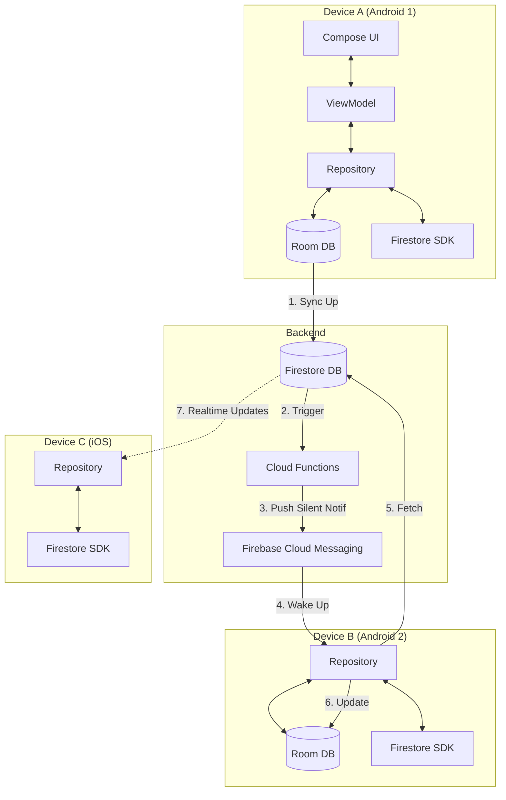

# 📱 Sync Task: Cross-Platform Reminders, Perfectly Synced.

<div align="center">

**Built for [RevenueCat Shipyard Hackathon 2026](https://www.revenuecat.com/shipyard)**

*"A beautiful fully functional reminders app that works properly on both iOS and Android."* - Sam Beckman's Brief

[](https://opensource.org/licenses/MIT)
[](https://kotlinlang.org)
[](https://www.jetbrains.com/lp/compose-multiplatform/)
[](https://www.revenuecat.com)

[Features](#-features-meeting-the-brief) • [Tech Stack](#-tech-stack) • [Architecture](#-architecture) • [Setup Guide](#-setup-guide) • [Hackathon Story](#-the-hackathon-story)

</div>

---

## 📖 The Brief & The Solution

**The Challenge:** Sam Beckman needs a reminder app that:
1.  **Syncs Properly:** Dismiss on one device, it disappears everywhere.
2.  **Custom Snoozing:** Snooze for *exactly* 22 minutes without opening the app.
3.  **Powerful Recurrence:** "Every 3 days", "Every 6 months".
4.  **Beautiful Design:** Must look great and feel smooth on both iOS and Android.

**The Solution:** **Sync Task** creates a seamless bridge between your devices using a "Local-First, Cloud-Synced" architecture.

| Feature                   | How Sync Task Solves It                                                                                                                                                    |
|:--------------------------|:---------------------------------------------------------------------------------------------------------------------------------------------------------------------------|
| **Dead App Sync** 💀      | We use **Firebase Cloud Functions** to listen for changes and wake up closed apps via high-priority FCM messages. Sync happens even if you haven't opened the app in days. |
| **Smart Snooze** 💤       | **Android Overlay Activities** allow you to type *any* minute duration directly from the notification. No opening the app, no preset limits.                               |
| **Complex Recurrence** 🔁 | Custom recurrence engine supports "Every X Days/Weeks/Months", specific days of the week, and smart end dates.                                                             |
| **Native Feel** 📱        | **Compose Multiplatform** ensures pixel-perfect UI, while platform-specific code handles native notifications, precise alarms (Android), and Time Sensitive alerts (iOS).  |

---

## 🚀 Features: Meeting the Brief

### 1. True Cross-Device Sync
*   **Real-Time:** Firestore listeners propagate changes in <1 second.
*   **Background Sync:** If you complete a task on Android, your iPad (sitting in a drawer) wakes up silently, updates its local DB, and cancels the pending notification. **No more double notifications.**
*   **Conflict Resolution:** Last-Write-Wins strategy based on high-precision timestamps.

### 2. Powerful Notification Actions
*   **Android:**
    *   **Custom Snooze Overlay:** A transparent activity pops up over your lock screen/app to let you type a specific snooze duration.
    *   **Reschedule:** Pick a new date/time instantly.
*   **iOS:**
    *   **Native Actions:** Long-press to Snooze (1h, Tomorrow) or Complete.
    *   **Time Sensitive:** Critical reminders break through Focus modes.

### 3. Advanced Organization (Free & Premium)
*   **Free:** 15 active reminders, 3 groups, basic recurrence.
*   **Premium ($3.99/mo):**
    *   Unlimited reminders & groups.
    *   **Advanced Recurrence:** "Every 3rd Friday", "Every 2 days ending in December".
    *   **Subtasks:** Break down "Publish Video" into "Script", "Film", "Edit".
    *   **Tags:** Color-coded organization.

---

## 🛠 Tech Stack

**Sync Task** is a showcase of modern **Kotlin Multiplatform (KMP)** development.

### Shared Core (CommonMain)
*   **Language:** Kotlin 2.3.0
*   **UI:** Compose Multiplatform 1.10.0
*   **Architecture:** MVVM with Clean Architecture.
*   **DI:** **Koin 4.1.1** (Annotation-based, scoped ViewModels).
*   **Database:** **Room KMP 2.8.4** (SQLite) - Single Source of Truth for the UI.
*   **Networking:** **Ktor 3.4.0** + **GitLive Firebase** (Firestore, Auth).
*   **Business Logic:** `RecurrenceService`, `NotificationCalculator` (Shared 100%).

### Platform-Specific Superpowers
*   **Android:**
    *   `AlarmManager` for exact-time scheduling.
    *   `SnoozeDialogActivity` (Transparent theme) for the custom snooze UI.
    *   **Material 3** theming.
*   **iOS:**
    *   `UNUserNotificationCenter` for local scheduling.
    *   SwiftUI interoperability for specific native views.
    *   **Ktor Darwin** engine for networking.

### Backend (Serverless)
*   **Firebase Cloud Functions (Node.js):** The "Glue" that makes sync work.
    *   `onReminderStatusChanged`: Detects when a reminder is done on one device -> Sends silent push to others.
    *   `onReminderCreated/Deleted`: Keeps all devices in sync.
*   **Firebase Cloud Messaging (FCM):** High-priority data messages to wake apps.

---

## 🏗 Architecture Diagram



---

## 🔧 Setup Guide

### Prerequisites
*   Android Studio Ladybug+
*   Xcode 15+ (for iOS)
*   JDK 17
*   RevenueCat Account & API Keys
*   Firebase Project (Blaze Plan for Cloud Functions - Free tier generous)

### 1. Clone & Configure
```bash
git clone https://github.com/yourusername/sync-task.git
cd sync-task
```

### 2. Secrets Management
Create `composeApp/local.properties` (Android) and `iosApp/Configuration/Secrets.xcconfig` (iOS).

**Android (`local.properties`):**
```properties
GOOGLE_WEB_CLIENT_ID=your-client-id.apps.googleusercontent.com
REVENUECAT_API_KEY=goog_your_revenuecat_key
```

**iOS (`Secrets.xcconfig`):**
```properties
GOOGLE_IOS_CLIENT_ID=your-ios-client-id.apps.googleusercontent.com
GOOGLE_IOS_URL_SCHEME=com.googleusercontent.apps.your-ios-client-id
REVENUECAT_API_KEY=appl_your_revenuecat_key
```

### 3. Firebase Setup
1.  Add `google-services.json` to `composeApp/`.
2.  Add `GoogleService-Info.plist` to `iosApp/iosApp/`.
3.  **Deploy Functions:**
    ```bash
    cd functions
    npm install
    firebase deploy --only functions
    ```
  
### 4. iOS Dependency Setup (Xcode)
Since this is a Kotlin Multiplatform project with native iOS dependencies, you need to add the following **Swift Packages** directly in Xcode:

1.  Open `iosApp/iosApp.xcworkspace`.
2.  File > Add Package Dependencies...
3.  Add the following:
    *   **RevenueCat:** `purchases-hybrid-common` (Use Version 8.0.0+)
    *   **Firebase:** `firebase-ios-sdk` (Core, Auth, Firestore, Messaging)
    *   **Google Sign-In:** `GoogleSignIn-ios`
4.  Ensure these libraries are linked in "Build Phases" > "Link Binary With Libraries".

### 5. Build & Run
**Android:**
```bash
./gradlew :composeApp:installDebug
```
**iOS:** Open `iosApp/iosApp.xcworkspace` in Xcode -> Run.

---

## 💰 RevenueCat Integration

We use **RevenueCat** to power the "Pro" experience seamlessly across platforms.

*   **Entitlements:** `premium_access` (Mapped to Play Store & App Store products).
*   **Offerings:** Configured dynamically in the RevenueCat dashboard.
*   **Implementation:**
    *   `SubscriptionRepository` observes `Purchases.shared.customerInfo`.
    *   Compose UI updates instantly when `entitlement.isActive` becomes true.
    *   **Hackathon Implementation Note:**
        *   **Android:** Fully functional Google Play Billing.
        *   **iOS:** Since we do **not** have a paid Apple Developer Account, we cannot create In-App Purchase products in App Store Connect.
        *   **The Fallback:** On iOS, the app gracefully handles the "Product Not Found" error by showing a fallback UI. Ideally, a user would purchase Premium on Android (where we have products configured), and the entitlement would **sync instantly to iOS** via RevenueCat's cross-platform user ID system.

---

## ⚠️ Known Limitations

1.  **iOS Background Sync (Free Dev Account):** Without a paid Apple Developer account ($99/yr), "Silent Push" notifications needed for background sync won't be delivered reliably if the app is force-quit. They work fine in the simulator or if the app is suspended.
2.  **Exact Alarms:** Android 13+ requires user permission for exact alarms. The app handles this gracefully by prompting the user on the first schedule.

---

## 🏆 Hackathon Story: Why We Built This

We heard Sam's frustration. "Why can't I just have a reminder app that works?"

Existing solutions were either:
*   **Too Simple:** Basic lists, no complex recurrence.
*   **Platform Locked:** Apple Reminders is great, but iOS only. Android apps don't sync to iPad.
*   **Broken Sync:** "Why is my old phone buzzing for a task I finished an hour ago?"

**Sync Task** was built to answer these specific pain points. By combining the power of **Kotlin Multiplatform** for shared logic with **Platform-Specific** capabilities (like Android Overlays and iOS Time Sensitive Notifications), we believe we've hit the sweet spot.

**Enjoy the sync!** 🔄

---

<div align="center">

**[View Demo Video](#)** • **[Download APK](#)**

Built with ❤️ by [Your Name]

</div>
