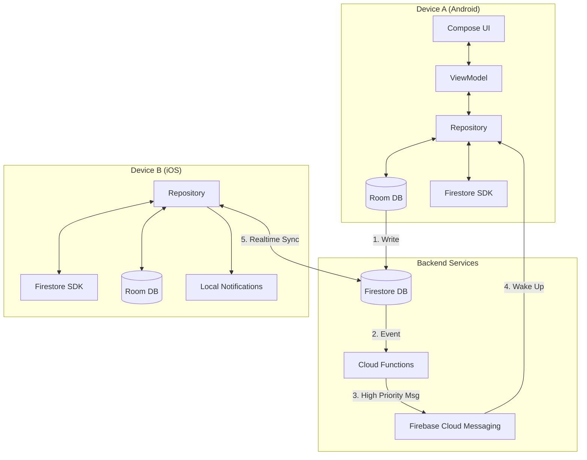

# 🛠 SyncTask: Technical Deep Dive

This document provides a detailed look into the architecture, technical decisions, and implementation specifics of **SyncTask**, built for [RevenueCat Shipyard](https://www.shipyard.fyi/).

---

## 🏗 Architecture Overview

SyncTask follows a **Local-First, Cloud-Synced** architecture. The app works 100% offline, relying on a local Room database as updates are propagated asynchronously to Firestore.

### High-Level Components

*   **Presentation Layer (UI):** 100% **Compose Multiplatform**. One UI codebase for Android and iOS.
*   **Domain Layer:** Pure Kotlin. Contains `Repository Interfaces`, and shared logic like `NotificationCalculator` and `RecurrenceService`.
*   **Data Layer:**
    *   **Local:** **Room KMP** (SQLite) - The Single Source of Truth for the UI.
    *   **Remote:** **Firestore** - Acts as the message broker and long-term storage.
*   **Platform Layer:**
    *   **Android:** `AlarmManager` (Exact Alarms), `FCMService` (Wake-up), `Activity` (Overlays).
    *   **iOS:** `UNUserNotificationCenter` (Local Notifs), `APNs` (Best-effort sync).

### Sync Architecture Diagram



---

## 🔄 The Sync Engine

The core challenge was syncing data even when apps are closed.

### 1. Database Schema (Firestore)
*   **Collection:** `users/{uid}/reminders/{reminderId}`
*   **Fields:**
    *   `id`: UUID
    *   `title`, `description`: Strings
    *   `dueTime`: Timestamp
    *   `status`: 'active' | 'completed' | 'deleted' | 'snoozed'
    *   `lastModified`: Long (Timestamp for Conflict Resolution)
    *   `recurrence`: JSON Map (Complex rules)

### 2. Conflict Resolution (Last-Write-Wins)
I avoid complex merging by using a simple LWW strategy.
*   Every write to the local DB updates the `lastModified` timestamp.
*   When fetching from Cloud:
    *   `if (cloud.lastModified > local.lastModified) { overwriteLocal() }`
    *   `else { ignoreCloud() }`

### 3. Dead App Synchronisation (Android)
Solved the "Dead App" problem using Firebase Cloud Functions + FCM Data Messages.

**The Workflow:**
1.  User completes a task on Device A.
2.  Firestore document updates.
3.  **Cloud Function** `onReminderStatusChanged` triggers.
4.  Function loads all users' FCM tokens from `users/{uid}/fcmTokens`.
5.  Sends a **High Priority Data Message** (`content_available: true`).
6.  **Device B (Android)** receives message in `FCMService` (even if app is killed).
7.  `FCMService` triggers `ReminderRepository.sync()`.
8.  Repository fetches update, updates Room DB.
9.  `NotificationCalculator` runs and **cancels/reschedules the Android Alarm**.
10. **Result:** The user never gets a notification for a task they already finished.

### 4. iOS Sync Strategy
Without a paid Apple Developer Account (required for background APNs), the app falls back to a robust **Foreground Sync**:
*   `Firestore` listeners are attached immediately on app launch.
*   Data syncs in < 500ms.
*   Local notifications allow the user to see reminders even if offline.

---

## 🤖 Cloud Functions Logic

Used Node.js functions to act as our "Backend".

```javascript
// index.js (Simplified)

exports.onReminderStatusChanged = functions.firestore
  .document('users/{uid}/reminders/{reminderId}')
  .onUpdate(async (change, context) => {
    const after = change.after.data();
    const uid = context.params.uid;

    // Payload designed for silent wake-up
    const payload = {
      data: {
        action: 'UPDATE',
        reminderId: after.id,
        timestamp: Date.now().toString()
      }
    };

    // Send to all devices excluding source (if optimized)
    await admin.messaging().sendToTopic(`user_${uid}`, payload);
});
```

---

## 📱 Platform Specifics

### Android Overlays 🎨
To allow custom snoozing without opening the app, I used **Transparent Activities**.
*   **Style:** `Theme.Transparent` (No title, transparent background, dim background).
*   **Trigger:** PendingIntent from Notification Action.
*   **Benefit:** Users stay in their context (Lock screen or other app) while interacting with SyncTask.

### iOS Time-Sensitive Notifications ⏰
I utilise iOS 15+ Time Sensitive interruptions.
*   **Entitlement:** Added to ensure reminders break through Focus Modes (when permitted).
*   **Implementation:** `UNNotificationInterruptionLevel.timeSensitive`.

---

## 💰 RevenueCat Implementation

**Entitlement:** `premium_access`

*   **Android:** Fully integrated with Google Play Billing.
*   **iOS:** Uses a "ReadOnly" mode.
    *   Since I cannot configure products without a paid account, the iOS app checks for entitlements but handles purchase errors gracefully.
    *   **Cross-Platform Sync:** Users who purchase on Android can "Restore Purchases" or simply log in on iOS to unlock features, thanks to RevenueCat's user management.

---

## 🛠 Tech Stack Details

| Component | Library | Notes |
| :--- | :--- | :--- |
| **Language** | Kotlin 2.3.0 | 100% Shared Code |
| **UI** | Compose Multiplatform 1.10.0 | Shared rendering |
| **DI** | Koin 4.1.1 | Simple, service-locator style DI |
| **Net** | Ktor 3.4.0 | CIO (Android) / Darwin (iOS) |
| **DB** | Room KMP 2.8.4 | SQLite with Coroutines support |
| **Async** | Coroutines 1.10.2 | Structured concurrency |
| **Date** | kotlinx-datetime 0.7.1 | UTC-based time math |
| **Auth** | GitLive Firebase 2.4.0 | Cross-platform wrappers |

---

## 🔐 Security Rules

Standard Firestore rules ensure data isolation.

```javascript
rules_version = '2';

service cloud.firestore {
  match /databases/{database}/documents {
    
    // User's reminders
    match /users/{userId}/reminders/{reminderId} {
      allow read, write: if request.auth != null && request.auth.uid == userId;
    }
    
    // User's groups
    match /users/{userId}/groups/{groupId} {
      allow read, write: if request.auth != null && request.auth.uid == userId;
    }
    
    // User's tags
    match /users/{userId}/tags/{tagId} {
      allow read, write: if request.auth != null && request.auth.uid == userId;
    }
    
    // User's FCM tokens
    match /users/{userId}/fcmTokens/{tokenId} {
      allow read, write: if request.auth != null && request.auth.uid == userId;
    }
    
    // User document
    match /users/{userId} {
      allow read, write: if request.auth != null && request.auth.uid == userId;
    }
  }
}
```
---

## 🔮 Future Engineering

*   **WebAssembly (Wasm):** Porting the Compose UI to Web for a browser-based client.
*   **E2E Encryption:** Encrypting reminder titles/descriptions before sending to Firestore.
*   **CRDTs:** Moving from Last-Write-Wins to Conflict-Free Replicated Data Types for true collaborative editing.
